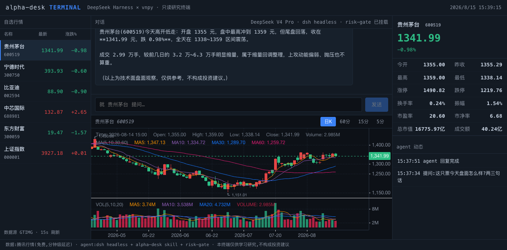

<div align="center">

# Alpha Desk

**Turn a deepseek-harness (dsh) session into a compliance-first, reproducible, accountable AI investment desk**

[](LICENSE)
[](terminal/backend/requirements.txt)
[](https://github.com/deepseek-ai/deepseek-harness)
[](https://github.com/virattt/ai-hedge-fund)
[](terminal/README.md)
[](terminal/demo/alpha-desk-terminal-demo.mp4)

English | [中文](README.md)

</div>

> [!WARNING]
> **For education and research only. Not investment advice. This project does not execute real trades for now.** The risk-gate architecturally denies all live orders, brokerage APIs and credential access.

> Turns a [deepseek-harness](https://github.com/deepseek-ai/deepseek-harness) (dsh) session into an investment research desk:
> multi-strategy AI fund backtesting + China A/H-share technical analysis + a compliance gate + scheduled monitoring + investment memory.
> This repo is an installable dsh **skill pack** (AI hedge fund / quant backtesting / agent risk control), and a complete demonstration of dsh's microkernel extension points (skill / hook / cron / memory).



## What it solves

General-purpose agent frameworks can chat, but investment research needs four more things:

1. **A reproducible engine** — conclusions must come from real data and real computation, not improvised by the model
2. **A compliance boundary** — as agents gain power, "can never touch real money" must be an architectural guarantee, not a prompt convention
3. **Persistence** — investment theses should be recorded, re-checked on a schedule, and held accountable
4. **Multi-market coverage** — US, A-shares and HK shares each have their own data and logic

Alpha Desk maps one dsh extension point to each problem:

| Problem | dsh extension point | Implementation here |
|---|---|---|
| Reproducible engine | skill (`section` + `inject()`) | [`skill/SKILL.md`](skill/SKILL.md): orchestrates the [virattt/ai-hedge-fund](https://github.com/virattt/ai-hedge-fund) CLI; pure JSON on stdout, everything persisted |
| Compliance boundary | hook (`tools/pre-execute` waterfall) | [`plugins/risk-gate`](plugins/risk-gate/index.ts): live orders, brokerage APIs and credential access are denied before dispatch |
| Persistence | cron + memory | SKILL.md workflows 4/5: pre-market scans, weekend reviews, a thesis ledger |
| Multi-market | skill composition | US via aihf; A/H-shares via the `stock-technical-indicators` skill |
| Authoritative data | agent tooling | [`plugins/ifind`](plugins/ifind/README.md): iFinD fundamentals (filings / announcements / shareholders / forecasts / screener) via Kimi agent-gw — no iFinD account needed |

## Architecture

```
user (natural language)
   │
   ▼
deepseek-harness agent ── inject ──► skill/SKILL.md (this repo)
   │                                   │
   │   tools/pre-execute               ▼
   │ ◄── risk-gate plugin (denies      aihf CLI (ai-hedge-fund engine)
   │      live trading)                 │  stdout: CycleRecord / BacktestResult JSON
   │                                   ▼
   │                              records/*.json (persisted for review)
   │
   ├── cron: scheduled pre-market / weekend research workflows
   └── memory: thesis ledger, reviewed against records at expiry
```

The underlying engine [ai-hedge-fund](https://github.com/virattt/ai-hedge-fund) (MIT) makes the fund a declarative mandate: strategy pods, investor alpha models (Graham / Buffett / Munger / Lynch / Druckenmiller + a quant PEAD), risk limits and rebalance cadence are YAML data; tickers are a run-time `--tickers` input. aihf natively supports **DeepSeek as its reasoning LLM** — a DeepSeek model inside the DeepSeek harness driving an AI fund, one stack end to end.

## Quant terminal (terminal/)

The agent capabilities above, packaged into a Tonghuashun-style web terminal — real-time A-share watchlist quotes, K-lines, an expert-panel signals view, and a chat pane where every reply passes the risk-gate and ships with a step-by-step trace (reasoning / tool-calls / token usage). The data layer wraps Tencent's free quotes (minute-level delay) in **vnpy**'s BarData/TickData object model and Gateway semantics — a drop-in swap for CTP/SimNow later; the agent runs via `dsh --profile headless` with the risk-gate patch mounted. **Read-only research terminal: there is no order path.**

📺 [90-second demo video](terminal/demo/alpha-desk-terminal-demo.mp4) · setup & API docs in [terminal/README.md](terminal/README.md)

## Quick start

```bash
# 1. Install the engine (isolated via pipx)
pipx install aihf

# 2. Configure keys (shell env, or ~/.hedge-fund/.env)
export FINANCIAL_DATASETS_API_KEY=...   # prices & fundamentals; free tier at financialdatasets.ai
export DEEPSEEK_API_KEY=...             # reasoning LLM for the alpha models

# 3. Verify the engine manually
aihf mandates/deep-value-weekly.yaml --tickers AAPL,MSFT,NVDA --backtest

# 4. Install the skill into dsh (add skill/ to your skills search path,
#    e.g. symlink into ~/.agents/skills/alpha-desk)
ln -s "$PWD/skill" ~/.agents/skills/alpha-desk

# 5. (Optional but recommended) enable the risk-gate plugin, see plugins/risk-gate/
```

Then talk to dsh in plain language:

- "Backtest the deep-value fund on AAPL, MSFT and NVDA over the past year"
- "Where do Buffett and Graham disagree on NVDA?"
- "Run the position signals every trading day before the open"
- "Review last week's watchlist — what was right, what was wrong?"

## Repository layout

```
dsh-alpha-desk/
├── skill/SKILL.md                        # the dsh skill (triggers, workflows, compliance red lines)
├── mandates/                             # three ready-to-run fund mandates
│   ├── deep-value-weekly.yaml            #   deep value (Graham×2 + Buffett + Munger), weekly
│   ├── fundamental-ls-market-neutral.yaml #  five-persona market-neutral L/S, monthly
│   └── inflections-daily.yaml            #   macro inflections (Druckenmiller + Lynch), daily
├── plugins/risk-gate/                    # dsh compliance hook plugin (tools/pre-execute)
├── plugins/ifind/                        # iFinD data source (via Kimi agent-gw, no iFinD account)
├── terminal/                             # quant terminal (vnpy data layer + FastAPI + React)
│   ├── backend/app/gateway_gtimg.py      #   Tencent quotes → vnpy BarData/TickData
│   ├── backend/app/fundamentals.py       #   iFinD fundamentals (agent-gw + 7-day cache)
│   ├── backend/app/agent_bridge.py       #   dsh headless bridge (risk-gate mounted)
│   └── web/                              #   React + klinecharts terminal UI
├── records/                              # persisted run records (git-ignored)
└── LICENSE                               # MIT
```

## Compared with mainstream agent frameworks

| Capability | Alpha Desk (dsh) | Raw LangChain/CrewAI orchestration | Generic coding agent + prompts |
|---|---|---|---|
| Compliance boundary | Architectural: hook denies before tool dispatch | Roll your own executor wrapper | Prompt-only; model can bypass |
| Research engine | Mature open-source fund engine, reproducible JSON | Assemble yourself | Improvised by the model, not reproducible |
| Scheduled monitoring | dsh cron extension point, declarative | External scheduler needed | None |
| Thesis accountability | memory + persisted records, auto review at expiry | Build your own state layer | None |
| Hot reload / ecosystem | dsh plugin HMR; MCP/skill ecosystem reuse | — | — |

## FAQ

**Q: Can Alpha Desk place real trades for me?**

No — and that is an architectural guarantee, not a prompt convention: [risk-gate](plugins/risk-gate/index.ts) sits on dsh's `tools/pre-execute` waterfall and monotonically denies live orders, brokerage APIs and credential file access before dispatch. "Never touches real money" is the design goal of this repo.

**Q: Can I use it without dsh?**

Partially. The `mandates/*.yaml` files are standard aihf mandates — `aihf mandates/deep-value-weekly.yaml --tickers AAPL,MSFT --backtest` runs on its own. The skill orchestration, cron monitoring and thesis-memory layers require deepseek-harness.

**Q: Does it backtest A-shares / HK shares?**

US equities run on the aihf engine (Financial Datasets data). A/H-shares currently get quotes + technical analysis (Tencent quotes + the `stock-technical-indicators` skill) and iFinD fundamental lookups ([plugins/ifind](plugins/ifind/README.md)); A/H fundamental backtesting is not available yet — limited by free data sources.

**Q: Is the data real-time?**

Tencent free quotes at minute-level delay; iFinD fundamentals go through the Kimi agent-gw with a 7-day disk cache to protect the monthly quota. Neither is a paid Level-1/Level-2 feed.

**Q: Can I trade on the backtest results?**

No. Backtests come from real data and real computation, fully persisted and reproducible — but past performance never guarantees future returns. All output here is for learning and research only.

## Limitations

- **No live-trading path**: risk-gate denies live orders / brokerage / credentials, and this project does not execute real trades — by design, not as a TODO
- **US-centric data**: the aihf engine's Financial Datasets mainly covers US equities; A/H fundamental backtesting is missing
- **Minute-level quote delay**: Tencent's free endpoint has no SLA or availability guarantee
- **iFinD is not an official connection**: relayed via the Kimi agent-gw, subject to quota and stability
- **Backtests ≠ future returns**: all strategy output is for learning and research only

## Credits

- Engine: [virattt/ai-hedge-fund](https://github.com/virattt/ai-hedge-fund) (MIT) — this project is an orchestration layer only and does not fork its code
- Runtime: [deepseek-ai/deepseek-harness](https://github.com/deepseek-ai/deepseek-harness)

## License

[MIT](LICENSE) © 2026 JingHao-Leon
